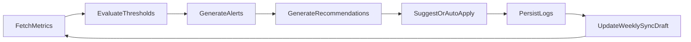

# Yamabushi x Auxora OpenClaw Heartbeat Spec
## OpenClaw 心跳监控与优化闭环规范

Version: 1.0  
Scope: Automated monitoring and optimization loop for Yamabushi execution account

---

## 1) Purpose | 目标

OpenClaw shifts operations from manual weekly reaction to proactive, threshold-based optimization:
- Monitor key metrics continuously
- Detect anomalies and trend breaks
- Suggest or auto-apply approved actions
- Feed insights into weekly sync and decision logs

OpenClaw 将执行从“每周被动复盘”升级为“持续主动巡检 + 阈值触发优化”。

---

## 2) Heartbeat Cadence | 心跳节奏

### Schedule
- Standard: every 30 minutes
- Quiet hours: configurable (e.g., 1-hour interval)
- Forced run: manual trigger from UI/API

### Execution Pipeline
1. Fetch latest data (Meta, Google, Shopify, tracking)
2. Compute metric deltas and rolling baselines
3. Evaluate thresholds
4. Generate alerts/recommendations
5. Optionally apply auto-actions
6. Persist logs and notify stakeholders

---

## 3) Data Inputs | 数据输入

Required inputs:
- Campaign performance metrics (spend, clicks, CTR, CPC, purchases, CPA, ROAS)
- Site/store metrics (sessions, conversion rate, AOV, revenue)
- Creative performance (by ad/video)
- Audience performance (by segment)
- Task and blocker status (from operations board)

Optional inputs:
- Seasonality calendar
- Inventory constraints
- Promotion calendar

---

## 4) Threshold Rules | 阈值规则

## Performance Alerts
- `ROAS_DROP_WARNING`: ROAS down >20% vs 7-day average
- `CPA_SPIKE_WARNING`: CPA up >25% vs 7-day average
- `CVR_DROP_WARNING`: conversion rate down >15% vs baseline
- `SPEND_PACING_ALERT`: spend pacing exceeds budget by >10%

## Channel-Specific Alerts
- `GOOGLE_LEARNING_STALL`: spend > threshold and zero purchase after N clicks
- `META_CREATIVE_FATIGUE`: CTR down and frequency up over rolling window
- `AUDIENCE_DECAY`: top audience performance drops below min target

## Operational Alerts
- `TASK_OVERDUE_ALERT`: critical task overdue
- `BLOCKER_ESCALATION_ALERT`: blocker unresolved over configured SLA

---

## 5) Recommendation Engine | 建议引擎

Each alert outputs:
- What happened
- Likely causes
- Suggested actions
- Confidence score
- Risk level

Example:

```json
{
  "alert_code": "GOOGLE_LEARNING_STALL",
  "severity": "medium",
  "summary": "Google spend increased but no purchase generated in current learning cycle.",
  "likely_causes": [
    "Search term mismatch",
    "Landing page relevance gap",
    "Insufficient conversion signal"
  ],
  "recommended_actions": [
    "Add negative keywords from search term report",
    "Shift 15% budget to proven Meta audience temporarily",
    "Validate pixel event integrity for purchase event"
  ],
  "confidence": 0.81
}
```

---

## 6) Auto-Action Policy | 自动执行策略

Action levels:
- `suggest_only`: recommendation only
- `approval_required`: requires agency/client approval
- `pre_authorized`: safe actions auto-applied

Pre-authorized examples:
- Pause clearly underperforming ad set within strict guardrails
- Reallocate small budget percentage to proven audience
- Trigger creative variant generation request

Never auto-apply:
- Large budget jumps
- Contract-impacting changes
- Major strategy pivots without approval

## Hard Guardrails (Machine-Enforced) | 机器硬护栏
- `max_budget_shift_pct_per_action` (e.g. <= 10%)
- `max_budget_shift_pct_per_day` (e.g. <= 20%)
- `cooldown_minutes` between auto-actions (e.g. 180)
- `daily_auto_action_limit` (e.g. 3)
- `requires_approval_above_pct` (e.g. > 8%)
- `allowed_action_types` whitelist
- `blocked_action_types` blacklist

Every auto-action must persist:
- `policy_snapshot`
- `why_triggered`
- `estimated_impact`
- `rollback_plan`

---

## 7) Weekly Sync Integration | 与周同步联动

OpenClaw contributes to weekly sync draft:
1. Top 3 performance shifts
2. Top 3 risks
3. Action completion summary
4. Recommended next-week priorities

Output schema should feed `WeeklySync` entity directly.

---

## 8) API Contract | 接口规范

Base path: `/api/openclaw`

- `POST /heartbeat/run`
- `GET /heartbeat/latest`
- `GET /alerts?status=open`
- `POST /alerts/:id/ack`
- `POST /actions/simulate`
- `POST /actions/apply`
- `GET /weekly-draft/:clientId`
- `GET /policy/:clientId`
- `PATCH /policy/:clientId`

### Heartbeat Run Response
```json
{
  "heartbeat_id": "uuid",
  "status": "ok",
  "alerts_generated": 3,
  "actions_suggested": 5,
  "actions_auto_applied": 1,
  "created_at": "timestamp"
}
```

---

## 9) Persistence | 存储模型

### openclaw_heartbeats
- id, client_id, run_type, status, metrics_snapshot, alert_count, action_count, created_at

### openclaw_alerts
- id, heartbeat_id, code, severity, summary, recommendation, status, created_at, resolved_at

### openclaw_actions
- id, alert_id, action_type, payload, mode, status, approved_by, created_at
- policy_snapshot, why_triggered, estimated_impact, rollback_plan

### openclaw_scorecards
- id, client_id, date, score_overall, score_channel, score_execution, score_risk

### openclaw_policies
- id, client_id
- max_budget_shift_pct_per_action
- max_budget_shift_pct_per_day
- cooldown_minutes
- daily_auto_action_limit
- requires_approval_above_pct
- allowed_action_types
- blocked_action_types
- created_at, updated_at

---

## 10) Observability | 可观测性

Required logs:
- Data fetch latency and failures
- Rule evaluation outcomes
- Action simulation/apply outcomes
- API integration failures (Meta/Google/Shopify)

Required dashboards:
- Alert volume by severity
- Auto-action success rate
- False-positive rate
- Time-to-resolution for critical alerts

---

## 11) Acceptance Criteria | 验收标准

1. Heartbeat runs on schedule and manual trigger.
2. Threshold alerts are generated with clear recommendations.
3. Auto-actions follow policy and are fully auditable.
4. Weekly sync draft includes OpenClaw insights automatically.
5. Alert-to-resolution cycle is visible in dashboard.
6. Hard guardrails block out-of-policy auto-actions deterministically.

---

## 12) Mermaid Loop Diagram



