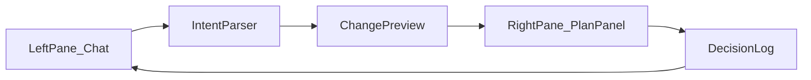

# Yamabushi x Auxora Product Interaction Spec
## Claude-like Dual Pane UX (Bilingual)

Version: 1.0  
Audience: Product, Design, Frontend, Backend, Agency Ops

---

## 1) Product Principle | 产品原则

### English
The product must feel simple for non-experts while preserving full operational depth for agency professionals.

### 中文
产品对非专业用户必须“易跟随、低认知负担”，同时对代理商专业人员保留完整控制能力。

---

## 2) Layout Contract | 双栏布局规范

## Left Pane: Guided Conversation | 左侧：对话引导
- Primary mode for novice users.
- Collects required inputs step-by-step.
- Converts free-form answers into structured fields.
- Suggests missing information and next action.

## Right Pane: Context + Plan Panel | 右侧：上下文与计划面板
- Canonical source of project truth.
- Shows phase progress, budget, weekly KPIs, tasks, risks, decisions.
- Editable by advanced users (with permissions).
- Reflects updates from chat in real-time.

## Header & Global Controls | 顶部全局控件
- Client selector
- Stage status badge
- “Sync now”, “Generate weekly report”, “Publish decision”
- Role switch: `Novice View` / `Advanced View`

---

## 3) User Modes | 用户模式

## Mode A: Novice User (Guided)
### Behavior
- User mainly follows prompts in left pane.
- Right pane is mostly read-only with highlighted “Next Step”.
- System asks only essential questions to progress stage gates.

### UI Constraints
- Hide deep media parameters by default.
- Use plain language and checklist cards.
- One primary CTA per step.

## Mode B: Advanced User (Direct Edit + Chat)
### Behavior
- User can edit right panel directly (budget split, milestones, task owners).
- Chat can still be used to request bulk updates.
- System always records change rationale into decision log.

### UI Constraints
- Editable tables and inline forms.
- Diff view for critical changes (budget, KPI targets).
- Approval workflow for high-risk edits.

---

## 4) Core Screens | 关键页面规范

## 4.1 Client Workspace (Main)
### Left
- Conversation timeline
- Prompt cards (Current Stage Questions)
- File upload dropzone (e.g., weekly report attachments)

### Right
- Stage progress rail
- KPI snapshot cards
- Budget phase block (Stage 1/2/3)
- “This Week Actions” and “Blockers”

## 4.2 GTM Consensus Screen
### Left
- Guided Q&A for goals, constraints, and assumptions

### Right
- GTM assumptions table
- KPI target matrix
- Consensus checklist + sign-off state

## 4.3 Agreement Screen
### Left
- Explain terms in plain language
- Collect confirmations

### Right
- Contract metadata (effective date, term, fee model)
- Service scope boundary matrix (In scope / Not in scope)

## 4.4 Execution Screen
### Left
- Weekly sync prompt sequence: performance -> diagnosis -> actions

### Right
- Channel performance table (Meta/Google)
- Audience and creative performance breakdown
- Next-week task board

## 4.5 OpenClaw Monitor Screen
### Left
- Alert explainer and suggested action chat

### Right
- Heartbeat timeline
- Threshold status board
- Automation action log and rollback controls

---

## 5) Interaction Rules | 交互规则

## 5.1 Chat-to-Panel Sync | 聊天到面板同步
- Chat response is parsed into structured payload.
- Mapped fields are previewed before commit.
- User confirms or edits before write.

## 5.2 Panel-to-Chat Sync | 面板到聊天同步
- Direct edits trigger a “change summary” message in chat.
- Critical edits require rationale text.

## 5.3 Conflict Handling | 冲突处理
- If chat suggestion conflicts with manual panel edit:
  1. Show diff
  2. Ask user to choose source of truth
  3. Log decision

---

## 6) Stage Gate UX | 阶段门禁体验

Stages:
`PreSales -> Consensus -> ContractSigned -> Execution -> WeeklySyncLoop -> Optimization`

Each stage requires:
- Required fields completed
- Required deliverables attached/approved
- Required owner assigned

Gate UI:
- Green: passed
- Yellow: pending input
- Red: blocker

---

## 7) Weekly Sync UX Spec | 周同步交互规范

## Input Sources
- Ad platform metrics
- Shopify revenue
- Last-week action completion

## Right Pane Sections
1. Week summary card
2. KPI variance table
3. Audience insight section
4. Creative insight section
5. Risk and blocker section
6. Next-week plan section

## Left Pane Prompts
- “What changed most this week?”
- “What underperformed and why?”
- “What 3 actions should we run next week?”

---

## 8) Accessibility and Simplicity | 可访问性与简化要求

- Keyboard navigable panels
- Clear heading hierarchy
- Inline explanation for every metric acronym
- Mobile fallback: stacked layout (chat first, panel second)

---

## 9) Acceptance Criteria | 验收标准

1. Novice user can complete core workflow without editing complex parameters.
2. Advanced user can edit plan directly and sync with chat.
3. Left-right synchronization is deterministic and auditable.
4. Stage gates and blocker statuses are visible at all times.
5. Weekly sync can be generated and updated in one workspace.

---

## 10) Mermaid Interaction Diagram

