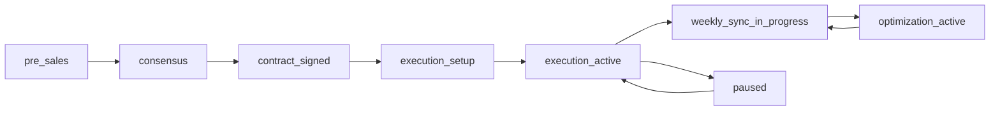

# Yamabushi x Auxora Workflow & State Machine Spec
## 客户执行流程与状态机规范

Version: 1.0

---

## 1) Master Workflow | 主流程

`PreSales -> Consensus -> ContractSigned -> Execution -> WeeklySyncLoop -> Optimization`

Each transition requires gate checks and audit trails.

---

## 2) State Definitions | 状态定义

## 2.1 ProgramState
- `pre_sales`
- `consensus`
- `contract_signed`
- `execution_setup`
- `execution_active`
- `weekly_sync_in_progress`
- `optimization_active`
- `paused`
- `closed`

## 2.2 TaskState
- `todo`
- `in_progress`
- `blocked`
- `review`
- `done`
- `cancelled`

## 2.3 DeliverableState
- `draft`
- `internal_review`
- `client_review`
- `approved`
- `rework_required`
- `finalized`

## 2.4 RiskState
- `open`
- `monitoring`
- `escalated`
- `mitigated`
- `closed`

---

## 3) Stage Gates | 阶段门禁

## Gate A: PreSales -> Consensus
Required:
- GTM assumptions completed
- KPI targets defined
- Priority channels identified

## Gate B: Consensus -> ContractSigned
Required:
- Scope alignment checklist approved
- Fee/term confirmed
- Stakeholder roles confirmed
- Agreement completeness = 100% for critical fields
- Sign evidence available for both parties (`signed_at_client`, `signed_at_provider`)
- Refund/notice/payment terms configured

## Gate C: ContractSigned -> Execution Setup
Required:
- Credential readiness >= minimum baseline
- Tracking plan ready
- Initial budget phases configured
- Attribution checks passed (Pixel/UTM/CAPI where applicable)
- Minimum credential set validated (critical + high priority keys)

## Gate Result Object | 门禁结果对象
- `gate_name`
- `passed`
- `missing_items[]`
- `blocker_level`
- `next_required_action`
- `checked_at`

## Gate D: Execution Setup -> Execution Active
Required:
- Campaigns/trackers launched
- Weekly sync template active
- Owner assignment complete

## Gate E: Weekly Sync Loop -> Optimization Active
Required:
- At least one full weekly sync completed
- KPI variance diagnosis logged
- Next-week action plan approved

---

## 4) Weekly Sync Sub-Workflow | 周同步子流程

`DataIngest -> Analysis -> InsightDraft -> Review -> Publish -> ActionPlanning -> FollowUp`

### State Controls
- `DataIngest` must complete before `Analysis`
- `Publish` requires review approval
- `ActionPlanning` requires owner + due date for each action item

---

## 5) Exception Paths | 异常路径

## Blocker Flow
`blocked -> triage -> attempt_fix -> (resolved | fallback_demo) -> continue`

Rule:
- If unresolved after 3 attempts, mark as fallback and continue main flow.

## Contract Risk Flow
If scope conflict arises:
1. Freeze affected tasks
2. Create decision record
3. Route to agency admin approval
4. Rebaseline timeline

---

## 6) Approval Rules | 审批规则

Needs approval:
- Budget ratio changes > 10%
- Channel objective change
- KPI target redefinition
- Auto-action policy changes
- Contract financial term updates

No approval needed:
- Non-critical task sequencing updates
- Copy changes without strategy impact

---

## 7) SLA & Escalation | SLA 与升级

- Critical blocker unresolved > 24h -> escalate to agency admin
- High blocker unresolved > 72h -> escalate in weekly sync
- Overdue critical task > 48h -> automatic alert

---

## 8) Acceptance Criteria | 验收标准

1. All states and transitions are explicit and enforceable.
2. Every transition is auditable.
3. Blocker handling supports fallback without halting full program.
4. Weekly sync loop is deterministic and repeatable.

---

## 9) Mermaid State Diagram

